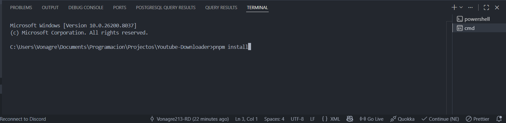
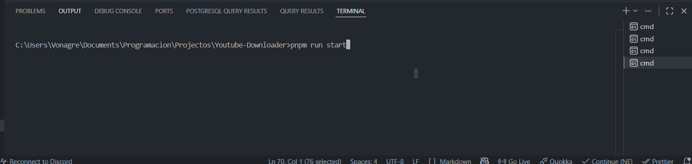

## If you are going to fork this project or use it in yours, please mention me ❤️

## YouTube Video Downloader!

Hello! This is a project I made with TypeScript to quickly download YouTube videos and audio.

# Prerequisites

1- This was made with **Node JS** so you must install it first before starting **download link ->**[Node.js — Download Node.js®](https://nodejs.org/en/download).

2- Also, I used **pnpm** instead of **npm** as the package manager, so you must install it first **Official installation link ->** [Installation | pnpm](https://pnpm.io/installation).

3- If it doesn't work, try moving it to the root of your drive, for example `C:\`, sometimes Windows blocks pnpm execution in some folders.

# Installation 

1- First download the file from **GitHub**, a .zip will be downloaded, extract it and open the folder with your code editor or terminal, I will be using **Visual Studio Code** for the guide.

2- Once you open the file, open a terminal and type:

```cmd
pnpm install
```



3- That's it! You have installed the downloader! Now proceed to the usage guide!

# Usage

1- You will see that there is a file called `downloadInfo.xml` (or `downloadData.xml`), that is where you will write all the information about the videos you want to download.

```xml
<configInfo format="" output="">
    <videosUrl>
       
    </videosUrl>
</configInfo>
        
```

# Example

```xml
<downloadData format="mp4" output="./music">
    <videosUrl>
        https://www.youtube.com/watch?v=dQw4w9WgXcQ,
        https://youtu.be/zsCD5XCu6CM?si=VkM8r6aVBCxX5pEV
    </videosUrl>
</downloadData>
        
```

# Tag Explanation

`downloadData`: This is the root tag that also contains the following attributes:

`format`: Format in which the videos will be downloaded, mp3 (audio only), mp4 (Video).

`output`: The path of the destination folder where the downloaded files will be saved.

--tags

`videosUrl`: Here go the URLs of the videos to be downloaded, separate each one with commas (,).

# How to run:

Just type `pnpm run start` in your terminal and it will execute the program.



# That's it! The program should start downloading the files!

If you find any error please, write an issue, I will be reading them from time to time.
